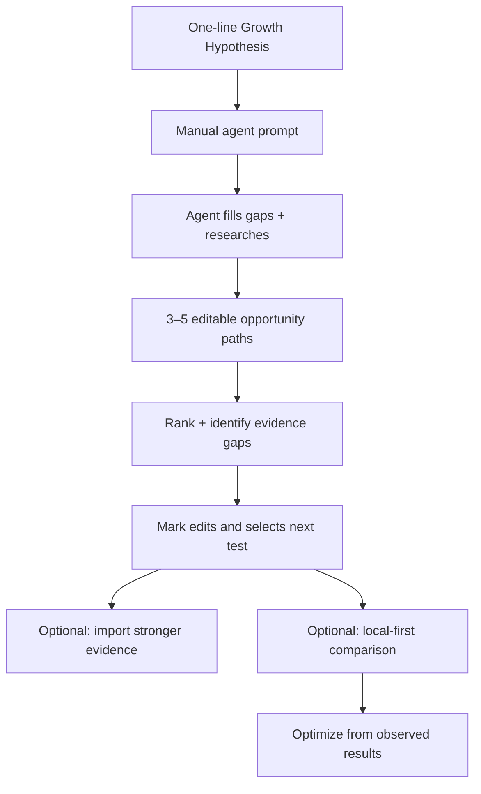
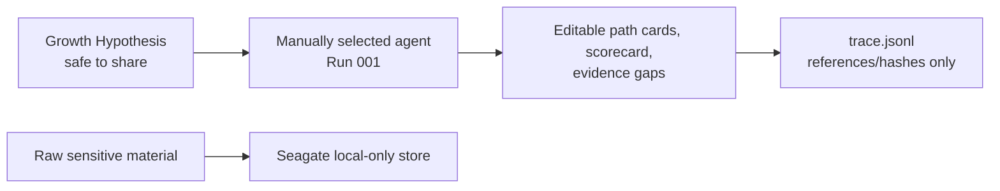
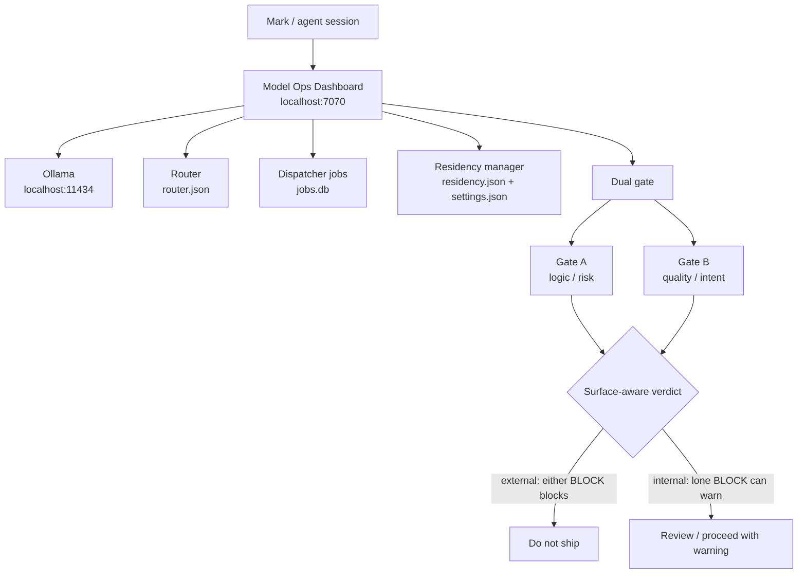
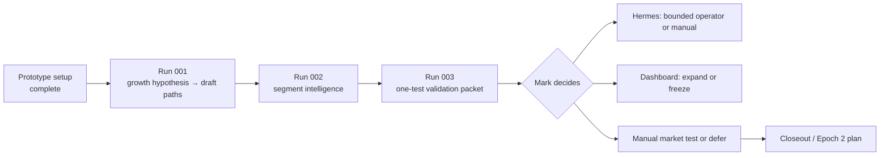

# MindfulText Epoch 1 — Context Map & Reference Index

Last updated: 2026-08-13 21:50:12 PDT — edited by: Codex

Use this map to understand historical Epoch 1 dependencies without treating it
as a competing current plan. For current MindfulText Growth work, use the
[[planning/GROWTH-SYSTEM-ORDERED-TASK-MAP|Growth Ordered Task Map]] and
[[planning/GROWTH-SYSTEM-MASTER-CHECKLIST|Growth Master Checklist]]. Use
[Current State](status/CURRENT-STATE.md) only for the retained research/run
record; for corpus lineage, use the [Lineage Map](EPOCH-1-HIERARCHY-DATA-LINEAGE.md).

## Historical research position

You are in an expanded learning loop—not a systems build. Market evidence now
extends through [[runs/run-011/RUN-011-Comedy-Concept|RUN-011]]; social ideas enter through a lightweight ledger and
become hypotheses, GTM motions, signals, or bounded runs only when their
decision and evidence justify it. `RUN-011` advanced `SOC-008` only to a
separately gated manual-baseline decision.

Historical research work is in `growth/`; historical re-entry and handoff are
in `status/`. Current Growth execution is in the two `planning/GROWTH-SYSTEM-*`
authority documents.
The root holds project authorities plus named project-level references such as
the non-authoritative lineage map. [DR-26](decisions/2026-07-12-folder-organization.md)

### Run 001 — start here

- **Give it one thought:** Add one sentence or any partial fields directly to
  [Growth Hypotheses](growth/HYPOTHESES.md). It begins as `exploring`; Product defaults to MindfulText.
  When known, select a stable audience ID from the
  [ICP Registry](growth/ICP-REGISTRY.md).
  [DR-24](decisions/2026-07-12-direct-growth-hypotheses.md)
  [DR-28](decisions/2026-07-12-icp-registry.md)
- **Prompt one agent:** manually choose Codex, Claude, or Hermes. Telegram is not involved. [Team config](team-configs/v0.1.1.md)
- **Receive editable drafts:** the agent fills missing fields, researches public
  sources, creates 3–5 paths, ranks them, and names evidence gaps. You can
  change any of it afterward.
- **Size only a clear segment:** once the agent can define the ICP by behavior
  and situation, it adds a cited U.S. TAM range. SAM/SOM wait until a narrower
  scope would change the next decision. [DR-27](decisions/2026-07-12-tam-first-market-sizing.md)
- **Aim it only when useful:** leave `Research: auto` or write a compact source,
  question, and score-contribution line. Set profile tracking to `off`,
  `discover`, or `watch` per hypothesis. [DR-25](decisions/2026-07-12-research-controls-and-profile-watch.md)
- **Use evidence later:** the original four assets strengthen or overturn the hypotheses; they do not block the first draft. [DR-22](decisions/2026-07-12-prototype-run-first.md)
- **Keep signals lightweight:** add a short signal under its hypothesis; use the
  [Signal Log](growth/SIGNALS.md) only when repeated sources make a shared log useful.

### Run 002 — Segment Intelligence + Local Research Evaluation

- **It turns a segment into a research map:** Run 002 is active for `SEG-001 — Care-delivery organizations`. It maps public accounts, buyer groups, category language, positioning, and contradictions; local work is evaluated as an input, not its only result. [Run card](runs/run-002/RUN-002-Segment-Intelligence.md)
- **No 24-hour gate:** take a local-work snapshot and call only that evaluation inconclusive if the machine misbehaves; public research may continue.
- **No monitoring or outreach:** account intelligence is public, cited, and bounded; it is not a CRM, scraper, or autonomous watcher. [DR-29](decisions/2026-07-13-segment-linked-runs.md)

### [[growth/CDP-001|CDP-001]] — Care-delivery customer development

- **Develop the segment without claiming validation:** `CDP-001` links
  `SEG-001` to its first focused branch `SEG-002`, `GH-004`, and `GTM-001`.
  It maps target intelligence, buyer paths, category language, and potential
  marketing opportunities before any external action. [CDP-001](growth/CDP-001.md)
- **Advance only through a separate gate:** a future public-research run or
  manual discovery conversation needs its own bounded card and Mark approval;
  this plan does not authorize monitoring, outreach, or publishing. [DR-31](decisions/2026-07-14-customer-development-plan.md)
- **Run bounded local research is complete:** `RUN-004` used 27 bounded local
  workers and one safe preflight block, producing six source-checked context
  cards plus a model-utility record. It did not perform outreach or tracking;
  its next choice is a separate manual source-opening pass or a pause.
  [Report](runs/run-004/outputs/RUN-004-REPORT.md) · [DR-32](decisions/2026-07-14-run-004-cdp-local-research.md)

### Run 005 — Care-delivery organization registry

- **A durable public account universe now exists:** `RUN-005` retained 56
  source-normalized organization records, an evidence ledger, and a buyer-
  function/title taxonomy for `SEG-001` and its `SEG-002` branch. It is not a
  CRM, contact list, buyer-intent signal, or outreach authorization.
  [Report](runs/run-005/outputs/RUN-005-REPORT.md) · [Registry](growth/account-registry/README.md) · [DR-33](decisions/2026-07-15-run-005-care-delivery-registry.md)
- **Freshness remains explicit:** Six accounts have additional public
  workforce/operating context; directory-only entries need a fresh first-party
  source opening before they can be ranked more strongly or proposed for any
  separate manual discovery step.

### Run 006 — Care-delivery one-degree market map

- **Map the immediate ecosystem:** `RUN-006` retained 50 source-backed nodes
  directly under, beside, or above `SEG-001`, with segments and organizations
  separated by relationship and node type. [Map](runs/run-006/outputs/one-degree-map.csv)
- **Keep one research surface:** The map and source ledger live together under
  `runs/run-006/outputs/`; the run did not create a code fork, merge code, or
  create a second data system. [DR-34](decisions/2026-07-15-run-006-one-degree-map.md)
- **Retain the next branch:** `SEG-002 / CCBHCs` remains the lead branch and
  `SEG-003 / FQHC integrated behavioral health` is the first comparison; home
  health, hospice, and aging services remain separate adjacent hypotheses.
  [Report](runs/run-006/outputs/RUN-006-REPORT.md)

### Run 007 — Care-delivery influence map

- **Map the public influence layer:** `RUN-007` retained 50 public-source-backed
  journalists, trade publications, blogs, newsletters, podcasts, associations,
  workforce channels, and creators across `SEG-001`. [Report](runs/run-007/outputs/RUN-007-REPORT.md)
- **Keep influence separate from buyers:** The registry is a research shortlist,
  not a contact list, buyer-intent signal, monitoring process, publishing plan,
  or outreach authorization. [Registry](runs/run-007/outputs/influence-registry.csv)
- **Choose a narrower comparison next:** Compare `operator-specialist` channels
  with `workforce-storytelling` channels only after Mark selects the branch and
  approves a subsequent bounded run.

### Run 008 — Care-delivery narrative and pain map

- **Rank the public narratives:** `RUN-008` forked `RUN-007`, attempted all 50
  public sources, and retained narrative, pain-point, term, and timeline outputs
  for `SEG-001` with comparisons to `SEG-002` and `SEG-003`. [Report](runs/run-008/outputs/RUN-008-REPORT.md)
- **Lead finding:** The public conversation centers on structural care capacity:
  workforce/retention, funding, administrative friction, access, coordination,
  rural constraints, and conditional technology adoption. [Pain ranking](runs/run-008/outputs/pain-point-ranking.csv)
- **Keep evidence bounded:** Recurrence is source-profile coding, not article
  frequency, audience prevalence, buyer intent, or demand validation; 3 lead-only
  sources remain explicitly excluded from the strongest conclusions. [Gaps](runs/run-008/outputs/coverage-gaps.md)
- **Next smallest test:** Select one care-delivery branch and map one concrete
  workflow or handoff before any market test, content action, or outreach.

### Run 009 — Direct Support Professional ICP qualification

- **New audience lead:** `RUN-009` finds that Direct Support Professionals are
  distinct enough from LCSWs to warrant a candidate ICP, but not yet a separate
  market segment. The likely user is frontline DSP staff; the possible sponsor
  is a provider workforce, operations, program, or executive leader. [Report](runs/run-009/outputs/RUN-009-REPORT.md)
- **Keep the boundary:** MHA material is a terminology/context anchor and the
  founder-supplied MHA Dutchess case is prioritization evidence only; neither
  validates DSP demand, engagement, efficacy, or transferability.
- **Next decision:** Mark reviews whether to create candidate `ICP-022` and
  chooses one DSP setting for a narrower public provider/workflow pass. No
  canonical ICP or segment record was changed by this run.

### Gap-analysis roadmap and feature backlog

- **Keep a de-risking view:** The roadmap applies the FourthWave method to
  MindfulText without replacing the approved path scorecard or the Master
  Checklist. Its 1–4 view measures evidence maturity, not company quality.
  [Roadmap](checklists/GAP-ANALYSIS-ROADMAP.md) · [DR-35](decisions/2026-07-15-gap-analysis-roadmap-and-feature-backlog.md)
- **Start with market truth:** Buyer-path/budget and
  alternatives/differentiation maps are the first proposal items; each informs
  the existing `E4` manual-market-test decision.
- **Preserve all gates:** Pilot design, trust/procurement answers, and
  capability/capital planning stay deferred until their named `E4`–`F4` entry
  conditions are satisfied. The backlog authorizes no build or external action.

### Run 010 — Epoch 1 hierarchy and data lineage

- **Map the retained corpus:** `RUN-010` records the source-linked hierarchy,
  ID registry, account lineage, buyer taxonomy, artifact graph, and adjacency
  relationships through [[runs/run-009/RUN-009-DSP-Qualification|RUN-009]]. It does not synthesize findings or make
  strategic recommendations. [Run card](runs/run-010/RUN-010-Data-Lineage.md)

### Social Learning Lane — first theme route qualified

- **Preserve ideas before promotion:** `SOC-001`–`SOC-008` capture Mark's
  Reddit/Pulse, content-mechanic, theme, founder-brand, AI-assistance, and
  unfinished playbook thoughts without pretending that each is evidence or a
  growth hypothesis. [Idea ledger](growth/SOCIAL-IDEA-LEDGER.md)
- **Recommended placement:** keep one Epoch 1 lab and use Pulse/n8n/Replit as
  replaceable adapters; do not create another epoch, clone, or worktree until a
  bounded execution establishes a distinct objective, owner, data boundary,
  and recurring maintenance need. [Lane outline](checklists/SOCIAL-LEARNING-LANE.md)
- **Approval boundary:** [[decisions/DECISION-REGISTER|DR-36]] records the founder direction and recommendation,
  and Mark selected the cross-cutting lane plus a first internal theme pass.
  [[runs/run-011/RUN-011-Comedy-Concept|RUN-011]] treats mindfulness-plus-comedy as a founder-theme route, not demand
  evidence or an external action. A manual baseline still needs a new card and
  specific approval. [Concept packet](runs/run-011/outputs/SOC-008-CONCEPT-PACKET.md) · [DR-36](decisions/2026-07-16-social-intelligence-founder-content-direction.md)

### Hermes — manual helper, no Telegram

- **Manual use is fine:** you can name Hermes in the Run 001 prompt now.
- **Telegram is irrelevant:** no Telegram route, inbound message, or autonomous task creation is part of this experiment.
- **Revisit only on need:** C4 becomes relevant only if you later want Telegram or autonomous Hermes behavior. [DR-22](decisions/2026-07-12-prototype-run-first.md)

## Historical Epoch 1 re-entry sequence

Use these stops only to recover the earlier research/run plan. They do not
replace the current Growth authority documents.

### Establish current status

- **Read the historical summary:** Start with the retained research facts and decisions. [Current state](status/CURRENT-STATE.md)
- **Separate approval from execution:** Run 001 is approved; it becomes executable when a `GH-###` item exists and Mark names the manual agent/provider. [Run card](runs/run-001/RUN-001-Growth-Path-Ranking.md)

### Confirm tracker ownership

- **Use positional checklist references only for the historical scope:** The root checklist retains document-position references (`A1`, `B1a`, `C4b`, etc.). [Master checklist](MASTER-CHECKLIST.md)
- **Find decisions through the register:** Use the Decision Register to resolve every `DR-*` identifier to its dated approval source and current checklist mapping. [Decision Register](decisions/DECISION-REGISTER.md)
- **Check the Mark summary:** Read the short status block before entering the detailed phase-by-phase checklist. [Mark summary](MASTER-CHECKLIST.md)

### Recover approval context

- **Confirm evidence classification:** [[decisions/2026-07-11-run-001-approvals|DR-13]] retained all four evidence candidates as `external-okay`, subject to spot-check at import. [DR-13](decisions/2026-07-11-run-001-approvals.md)
- **Confirm provider policy:** Mark names the provider/agent in the manual invocation prompt; Codex, Claude, and Hermes are usable in prototype mode. [DR-22](decisions/2026-07-12-prototype-run-first.md)
- **Confirm spending boundary:** [[decisions/2026-07-11-run-001-approvals|DR-16]] allows only Mark-held manual testing within existing OpenRouter limits; agents remain fail-closed at $0 external and sandbox spend. [DR-16](decisions/2026-07-11-run-001-approvals.md)

### Start the prototype loop

- **Add a Growth Hypothesis:** Fill one sentence or any partial fields using only material safe for the selected agent. It begins as `exploring`. [Growth Hypotheses](growth/HYPOTHESES.md)
- **Run a manual prompt:** Select Codex, Claude, or Hermes and ask it to fill gaps, research public sources, produce editable paths, and rank them. [Run 001 packet](runs/run-001/UNBLOCK-PACKET.md)
- **Edit and choose:** Treat the output as a working draft, not an irrevocable decision. Import evidence later where it would most change the ranking.

## 1. What is blocking what

**Interpretation:** the only thing between you and a useful first draft is a
one-line growth hypothesis. Evidence import, Telegram work, and stability
telemetry follow the learning loop; they do not control it.

## 2. Data and provider boundary

**Interpretation:** a brief is enough for hypothesis drafting. Keep raw
sensitive material in the Seagate store; the selected agent never needs it.
Hermes is just another manually selected drafting surface in this loop.

## 3. Local Model Ops architecture and controls

**Interpretation:** the dashboard is a local control plane, not the Run 001
provider. Its present health matters for Dispatcher and later local runs; Run
001 itself uses only Mark-named external provider surfaces.

## 4. Epoch decision timeline

## Complete Epoch 1 reference list

### A. Entry points and active operating record

| Resource | What it answers | Folder / path |
| --- | --- | --- |
| [Epoch 1 lab folder](.) | Working directory for the current lab scaffold; the planned `Projects/` move is not authorized or present. | `/Users/mgzm-studio/AI-Studio/Docs/mindfultext-epoch-1/` |
| [Project entry point](README.md) | Reading order and authority map for agents and Mark. | `/Users/mgzm-studio/AI-Studio/Docs/mindfultext-epoch-1/README.md` |
| [Growth Ordered Task Map](planning/GROWTH-SYSTEM-ORDERED-TASK-MAP.md) | Current founder-facing Growth roadmap. | `planning/GROWTH-SYSTEM-ORDERED-TASK-MAP.md` |
| [Growth Master Checklist](planning/GROWTH-SYSTEM-MASTER-CHECKLIST.md) | Current Growth tasks, status, gates, and evidence. | `planning/GROWTH-SYSTEM-MASTER-CHECKLIST.md` |
| [Current state](status/CURRENT-STATE.md) | Historical Epoch 1 research/run summary; not current Growth status. | `status/CURRENT-STATE.md` |
| [Master checklist](MASTER-CHECKLIST.md) | Historical status of position-referenced Epoch 1 research/run items. | `MASTER-CHECKLIST.md` |
| [Gap-analysis roadmap & feature backlog](checklists/GAP-ANALYSIS-ROADMAP.md) | Proposal-only company de-risking queue: current gaps, smallest proof, and the existing gate each item informs. | `/Users/mgzm-studio/AI-Studio/Docs/mindfultext-epoch-1/checklists/GAP-ANALYSIS-ROADMAP.md` |
| [Agent handoff](status/HANDOFF.md) | Historical Epoch 1 research/run handoff. | `status/HANDOFF.md` |
| [This context map](CONTEXT-MAP.md) | Dependency diagrams and this reference index. | `/Users/mgzm-studio/AI-Studio/Docs/mindfultext-epoch-1/CONTEXT-MAP.md` |

### B. Authority, decisions, and planning history

| Resource | Authority / use | Folder / path |
| --- | --- | --- |
| [AI-Studio operating instructions](/Users/mgzm-studio/AI-Studio/AGENTS.md) | Platform operation, routing, gates, memory, Dispatcher, and documentation protocol. | `/Users/mgzm-studio/AI-Studio/AGENTS.md` |
| [Canonical charter v1.9](CHARTER.md) | Lab authority, data rules, run lifecycle, and amendments. | `/Users/mgzm-studio/AI-Studio/Docs/mindfultext-epoch-1/CHARTER.md` |
| [Decision Register](decisions/DECISION-REGISTER.md) | Canonical index from every `DR-*` identifier to its source record and current checklist mapping; it is not approval authority. | `/Users/mgzm-studio/AI-Studio/Docs/mindfultext-epoch-1/decisions/DECISION-REGISTER.md` |
| [Decision record DR-1…DR-12](decisions/2026-07-10-epoch-1-foundation.md) | Original Epoch 1 decisions: D1–D4, caps, lab location, C4, and evidence policy. | `/Users/mgzm-studio/AI-Studio/Docs/mindfultext-epoch-1/decisions/2026-07-10-epoch-1-foundation.md` |
| [Run 001 approvals DR-13…DR-16](decisions/2026-07-11-run-001-approvals.md) | Evidence approval, rubric approval, no-default-provider amendment, and OpenRouter-bounded Mark manual-testing exception. | `/Users/mgzm-studio/AI-Studio/Docs/mindfultext-epoch-1/decisions/2026-07-11-run-001-approvals.md` |
| [Next-steps plan](planning/next-steps-plan.md) | Historical dependency plan and phase rationale; consult for context, not current status. | `/Users/mgzm-studio/AI-Studio/Docs/mindfultext-epoch-1/planning/next-steps-plan.md` |
| [Stability observation](observations/2026-07-10-stability-observation.md) | Historical evidence for the old core failure; now background telemetry, not a Run 002 gate. | `/Users/mgzm-studio/AI-Studio/Docs/mindfultext-epoch-1/observations/2026-07-10-stability-observation.md` |

### C. Run 001 execution package

| Resource | What it governs | Folder / path |
| --- | --- | --- |
| [Run 001 folder](runs/run-001) | The run-specific card, unblock packet, blackboard, and privacy-safe trace. | `/Users/mgzm-studio/AI-Studio/Docs/mindfultext-epoch-1/runs/run-001/` |
| [Run card](runs/run-001/RUN-001-Growth-Path-Ranking.md) | Exact allowed inputs, provider rule, limits, stop conditions, outputs, and approval. | `/Users/mgzm-studio/AI-Studio/Docs/mindfultext-epoch-1/runs/run-001/run-card.md` |
| [Run 001 packet](runs/run-001/UNBLOCK-PACKET.md) | Five-bullet founder-brief and manual-prompt handoff for the prototype run. | `/Users/mgzm-studio/AI-Studio/Docs/mindfultext-epoch-1/runs/run-001/UNBLOCK-PACKET.md` |
| [Blackboard](runs/run-001/RUN-001-Growth-Research-Notes.md) | Working notes for the run; do not place raw sensitive data here. | `/Users/mgzm-studio/AI-Studio/Docs/mindfultext-epoch-1/runs/run-001/blackboard.md` |
| [Trace](runs/run-001/trace.jsonl) | Reference/hash-only run trace; no raw inputs. | `/Users/mgzm-studio/AI-Studio/Docs/mindfultext-epoch-1/runs/run-001/trace.jsonl` |
| [ICP Registry](growth/ICP-REGISTRY.md) | Canonical audience IDs, buyer/channel distinction, founder-reported testing context, and adjacent segment candidates. | `/Users/mgzm-studio/AI-Studio/Docs/mindfultext-epoch-1/growth/ICP-REGISTRY.md` |
| [Growth Hypotheses](growth/HYPOTHESES.md) | One-line or partial idea entry; it starts directly as `exploring`, then agents research and fill missing fields as working hypotheses. | `/Users/mgzm-studio/AI-Studio/Docs/mindfultext-epoch-1/growth/HYPOTHESES.md` |
| [Public Profile Watch](growth/PUBLIC-PROFILE-WATCH.md) | Optional public-profile research watchlist, used only when a hypothesis sets `Profile tracking: watch`. | `/Users/mgzm-studio/AI-Studio/Docs/mindfultext-epoch-1/growth/PUBLIC-PROFILE-WATCH.md` |
| [Signal log](growth/SIGNALS.md) | Channel-agnostic capture of evidence that strengthens, weakens, or reranks a path. | `/Users/mgzm-studio/AI-Studio/Docs/mindfultext-epoch-1/growth/SIGNALS.md` |
| [Revenue-signal scorecard](growth/SCORECARD.md) | Approved five-dimension rubric, staleness rule, and signal ladder. | `/Users/mgzm-studio/AI-Studio/Docs/mindfultext-epoch-1/growth/SCORECARD.md` |
| [Team configs folder](team-configs) | Current and superseded provider-routing configurations. | `/Users/mgzm-studio/AI-Studio/Docs/mindfultext-epoch-1/team-configs/` |
| [Team config v0.1.1](team-configs/v0.1.1.md) | Approved no-default-provider rule. `v0.1.md` is superseded. | `/Users/mgzm-studio/AI-Studio/Docs/mindfultext-epoch-1/team-configs/v0.1.1.md` |
| [Team config v0.1 — superseded](team-configs/v0.1.md) | Historical Claude-only configuration retained for audit; do not use for new work. | `/Users/mgzm-studio/AI-Studio/Docs/mindfultext-epoch-1/team-configs/v0.1.md` |

### D. Working methods, templates, and validation

| Resource | What it is for | Folder / path |
| --- | --- | --- |
| [Research-to-signal workflow](workflows/research-to-signal.md) | The repeatable workflow from evidence to ranked testable paths. | `/Users/mgzm-studio/AI-Studio/Docs/mindfultext-epoch-1/workflows/research-to-signal.md` |
| [Templates folder](templates) | Run card, path card, decision, and compaction templates. | `/Users/mgzm-studio/AI-Studio/Docs/mindfultext-epoch-1/templates/` |
| [Tools folder](tools) | Run creation and validation utilities. | `/Users/mgzm-studio/AI-Studio/Docs/mindfultext-epoch-1/tools/` |
| [Tools README](tools/README.md) | Exact validator and new-run commands. | `/Users/mgzm-studio/AI-Studio/Docs/mindfultext-epoch-1/tools/README.md` |
| [Run-card template](templates/Run-Card-Template.md) | Required structure for a new run. | `/Users/mgzm-studio/AI-Studio/Docs/mindfultext-epoch-1/templates/run-card.md` |
| [Path-card template](templates/path-card.md) | Required structure for a candidate ROI path. | `/Users/mgzm-studio/AI-Studio/Docs/mindfultext-epoch-1/templates/path-card.md` |
| [Decision template](templates/decision.md) | Format for a dated decision record. | `/Users/mgzm-studio/AI-Studio/Docs/mindfultext-epoch-1/templates/decision.md` |
| [Compaction template](templates/compaction.md) | Format for a durable context handoff. | `/Users/mgzm-studio/AI-Studio/Docs/mindfultext-epoch-1/templates/compaction.md` |
| [New-run utility](tools/new-run.py) | Creates the standardized run folder and draft card. | `/Users/mgzm-studio/AI-Studio/Docs/mindfultext-epoch-1/tools/new-run.py` |
| [Run-card validator](tools/validate-run-card.py) | Validates a run card before approval and execution. | `/Users/mgzm-studio/AI-Studio/Docs/mindfultext-epoch-1/tools/validate-run-card.py` |

### E. Local Model Ops / architecture sources

| Resource | What it answers | Folder / path |
| --- | --- | --- |
| [Model Ops Dashboard project](/Users/mgzm-studio/AI-Studio/Projects/model-dashboard-live/) | Local dashboard source, API, Dispatcher, gates, residency, and logs. | `/Users/mgzm-studio/AI-Studio/Projects/model-dashboard-live/` |
| [Dashboard log](/Users/mgzm-studio/AI-Studio/Projects/model-dashboard-live/dashboard.log) | Timestamped service starts, re-pins, lease events, and errors. | `/Users/mgzm-studio/AI-Studio/Projects/model-dashboard-live/dashboard.log` |
| [Router configuration](/Users/mgzm-studio/AI-Studio/Projects/model-dashboard-live/router.json) | Task-to-model routing; do not hard-code models elsewhere. | `/Users/mgzm-studio/AI-Studio/Projects/model-dashboard-live/router.json` |
| [Residency configuration](/Users/mgzm-studio/AI-Studio/Projects/model-dashboard-live/residency.json) | Core model and residency profile. | `/Users/mgzm-studio/AI-Studio/Projects/model-dashboard-live/residency.json` |
| [Dashboard settings](/Users/mgzm-studio/AI-Studio/Projects/model-dashboard-live/settings.json) | Memory budget and enabled/disabled watchers. | `/Users/mgzm-studio/AI-Studio/Projects/model-dashboard-live/settings.json` |
| [Gate implementation](/Users/mgzm-studio/AI-Studio/Projects/model-dashboard-live/gates.js) | Surface-aware dual-gate verdict logic. | `/Users/mgzm-studio/AI-Studio/Projects/model-dashboard-live/gates.js` |
| [Dispatcher implementation](/Users/mgzm-studio/AI-Studio/Projects/model-dashboard-live/jobs.js) | Local task-card lifecycle and audit log. | `/Users/mgzm-studio/AI-Studio/Projects/model-dashboard-live/jobs.js` |

### F. Background and superseded planning material

These explain how Epoch 1 was designed. They are not the current execution
authority unless the master checklist or dated decision record points to them.

| Resource | Use | Folder / path |
| --- | --- | --- |
| [Planning folder](/Users/mgzm-studio/AI-Studio/Docs/epoch-1-planning-codex-claude/) | Historical architecture review, scope draft, finalization brief, and operations context. | `/Users/mgzm-studio/AI-Studio/Docs/epoch-1-planning-codex-claude/` |
| [Verification and decisions — archived](/Users/mgzm-studio/AI-Studio/Docs/archive/epoch-1/epoch-1-verification-and-decisions.md) | Historical evidence and adjudication behind the next-steps plan; not current authority. | `/Users/mgzm-studio/AI-Studio/Docs/archive/epoch-1/epoch-1-verification-and-decisions.md` |
| [Finalization brief — archived](/Users/mgzm-studio/AI-Studio/Docs/archive/epoch-1/mindfultext-epoch-1-finalization-brief.md) | Historical governance input; superseded by the project charter. | `/Users/mgzm-studio/AI-Studio/Docs/archive/epoch-1/mindfultext-epoch-1-finalization-brief.md` |
| [Scope draft — archived](/Users/mgzm-studio/AI-Studio/Docs/archive/epoch-1/epoch-1-scope-DRAFT.md) | Historical scope comparison input; not safe as operating authority. | `/Users/mgzm-studio/AI-Studio/Docs/archive/epoch-1/epoch-1-scope-DRAFT.md` |
| [Local LLM Ops plan](/Users/mgzm-studio/AI-Studio/Docs/epoch-1-planning-codex-claude/local-llm-ops-plan.md) | Broader operating strategy and repository practices. | `/Users/mgzm-studio/AI-Studio/Docs/epoch-1-planning-codex-claude/local-llm-ops-plan.md` |
| [Pi and local agents guide](/Users/mgzm-studio/AI-Studio/Docs/epoch-1-planning-codex-claude/pi-and-local-agents-guide.md) | Agent tooling/orchestration background; not Epoch 1 control-plane authority. | `/Users/mgzm-studio/AI-Studio/Docs/epoch-1-planning-codex-claude/pi-and-local-agents-guide.md` |
| [Next-steps brief — archived](/Users/mgzm-studio/AI-Studio/Docs/archive/epoch-1/epoch-1-next-steps-brief-2026-07-10.md) | Historical re-entry briefing; defer to the project entry point and Master Checklist. | `/Users/mgzm-studio/AI-Studio/Docs/archive/epoch-1/epoch-1-next-steps-brief-2026-07-10.md` |

## Authority rule when sources conflict

For current MindfulText Growth work, the [[planning/GROWTH-SYSTEM-ORDERED-TASK-MAP|Ordered Task Map]] is the founder-facing roadmap, the [[planning/GROWTH-SYSTEM-MASTER-CHECKLIST|Master Checklist]] owns detailed execution state, and dated `DR-*` records own approvals. The following order applies to the historical Epoch 1 research/run scope.

1. `AGENTS.md` governs platform, safety, local Model Ops, and documentation
   policy.
2. The canonical charter governs Epoch 1 lab roles and workflow.
3. A newer dated Mark decision amends older charter or plan language.
4. The master checklist is the current execution status, reconciled to those
   decisions.
5. Background documents explain history only; they cannot silently reopen a
   completed decision or authorize new work.
