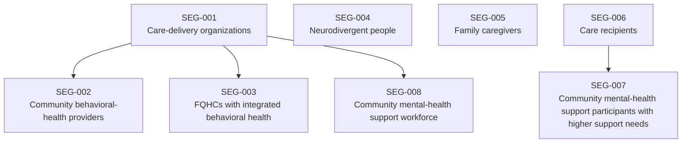
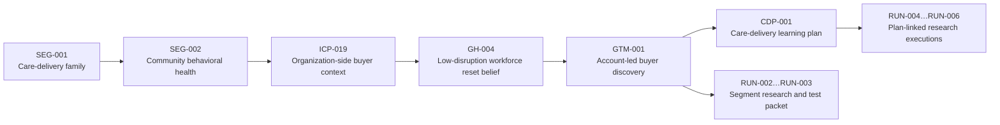
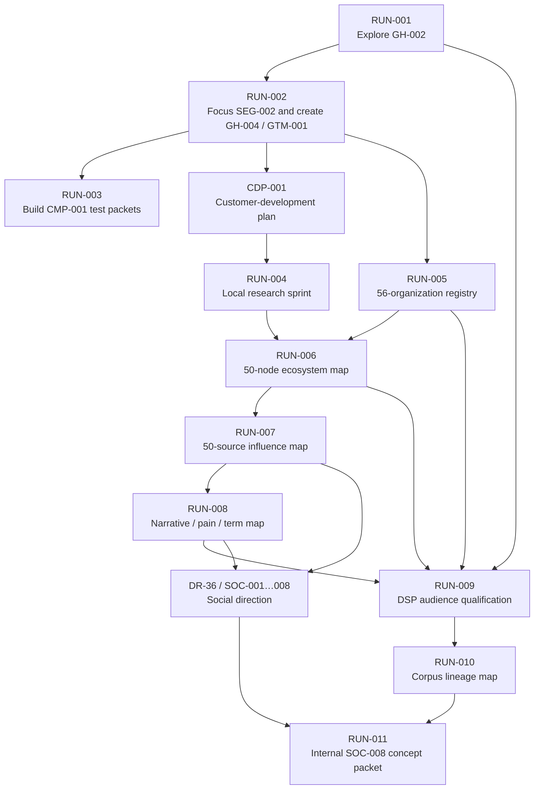

# Epoch 1 — Founder-Readable Hierarchy & Data Lineage Map

Last updated: 2026-07-16 21:15:25 PDT — edited by: Codex

This document is a guided tour of the Epoch 1 research system and a map back to
its exact source records. Read the descriptive names first and treat the codes
as permanent reference handles. The document explains structure and lineage;
it is **current through `SOC-008` and completed `RUN-011`**, but it is not live
task status. Use [Current State](status/CURRENT-STATE.md) for Mark's next
decisions, the [Context Map](CONTEXT-MAP.md) for dependencies, and the [Master
Checklist](MASTER-CHECKLIST.md) for executable status. It does not convert
research into validation, approve a run, or authorize monitoring, publishing,
outreach, or a market test.

**Refresh rule:** update this map after any new `SEG`, `ICP`, `GH`, `SOC`, or
`ACC` family expansion, or after a closed run changes the dependency graph;
otherwise leave the dated snapshot intact.

## A. Reading the Map — What the codes and layers mean

Epoch 1 separates durable business ideas from the temporary executions that
study them. That is why the same segment, audience, or hypothesis may appear in
several runs without being replaced by those runs.

### A1. Plain-English glossary

| Code | Read it as | What it stores | What it does **not** mean | Example with its descriptor |
| --- | --- | --- | --- | --- |
| `SEG-###` | Market segment | A stable market or audience boundary, including parent/child relationships | A validated market or a rank | `SEG-002 — Community behavioral-health providers` |
| `ICP-###` | Intended audience | A user, buyer, channel, partner, or research audience | A confirmed customer | `ICP-019 — Non-MHA community behavioral-health organizations, CCBHCs, and FQHCs` |
| `GH-###` | Growth hypothesis | One falsifiable belief about an audience, pain, offer, or route | A completed test or accepted fact | `GH-004 — Low-disruption workforce reset for community behavioral-health providers` |
| `GTM-###` | Go-to-market motion | A reusable way to learn from or reach a market | Permission to contact anyone | `GTM-001 — Account-led buyer discovery` |
| `CDP-###` | Customer-development plan | A linked learning plan across segments, hypotheses, and GTM motions | A run, campaign, or CRM | `CDP-001 — Care-delivery customer development` |
| `ACC-###` | Organization account | One immutable organization record with sources and open questions | Buyer intent, a person, or an outreach target | `ACC-001 — Centerstone` |
| `BGP-...` | Buyer-group profile | Possible buying functions and job titles to verify | A named buyer or confirmed authority | `BGP-CCBHC-001 — Community behavioral-health / CCBHC buyer functions` |
| `SOC-###` | Social idea | A founder thought, content mechanic, saved-example lead, or workflow idea | Evidence, a hypothesis, or a run | `SOC-001 — MindfulTextPulse / Reddit social-intelligence idea` |
| `RUN-###` | Bounded execution | One approved attempt with fixed inputs, tasks, outputs, and stop rules | The strategy itself | `RUN-005 — Care-delivery organization registry` |
| `DR-#` | Decision record | The durable source of a Mark decision and its caveats | Current task status by itself | `DR-36 — Social intelligence and founder-content direction` |
| `SRC-*`, `EV-*` | Evidence pointer | A public source row or a retained evidence record | A conclusion without its owning file and context | `EV-001 — MHA Dutchess founder-supplied evidence summary` |

### A2. Why names are separate from IDs

The IDs are deliberately flat and non-semantic. A number never means priority,
confidence, chronology across record types, or approval status. Keeping the ID
stable lets a title become more precise without breaking links in earlier runs.

The human-readable display rule is therefore:

> **Always show `ID — descriptive title` on first use.** Use the bare ID only
> after the reader has already seen its title nearby.

Status is a separate field. For example, every current `SEG-###` record is
still `candidate`; `GH-002` and `GH-004` remain `exploring`; and a completed
`RUN-###` does not automatically promote either one.

One technical exception matters: `SRC-###` values are local to their owning
registry or run. `RUN-005/SRC-002` and a source with the same short number in
another run are not automatically the same record. Cite the file or run with a
source ID.

### A3. What changed after the first map

| Change | Plain-English meaning | Current authority |
| --- | --- | --- |
| `RUN-010` closed | The original lineage pass is now a completed historical run rather than an active generation step. | [Run 010 card](runs/run-010/run-card.md) |
| `SEG-007` and `SEG-008` appeared | The segment map now separately represents higher-support community mental-health participants and the workforce supporting them. They were added after the original map's snapshot and have no separate originating run recorded. | [Segment Map](growth/SEGMENTS.md) |
| `DR-36` was recorded | Mark's social-intelligence and founder-content ideas received a durable direction record; Mark later selected the cross-cutting lane and founder-theme route. | [DR-36](decisions/2026-07-16-social-intelligence-founder-content-direction.md) |
| `SOC-001`–`SOC-008` were created | Eight social/content/workflow thoughts can be preserved without prematurely turning each one into a hypothesis or GTM motion. | [Social Idea Ledger](growth/SOCIAL-IDEA-LEDGER.md) |
| `RUN-011` closed | The internal `SOC-008` pass produced a positioning packet and advanced the theme only to a separately gated manual-baseline decision. It performed no publishing, monitoring, automation, or outreach. | [Run 011 card](runs/run-011/run-card.md) |
| Folder roles were clarified | Root files hold project authorities plus named project-level references; reusable business records live in `growth/`; executions live in `runs/`; proposals live in `checklists/`; approvals live in `decisions/`; re-entry material lives in `status/`. | [Project entry point](README.md) |

There has still been **no social-media external execution**. `RUN-011` was an
internal documentation-only lab-validation run: it produced no post, comment,
message, monitor, scrape, schedule, automation, or outreach action.

*Section A takeaway: read every code as a durable name tag attached to a
descriptive record, not as the meaning or verdict of that record.*

## B. Market Structure — What exists and how it nests

The business hierarchy moves from broad market boundaries toward a specific
belief and a bounded way to test it. Not every segment has reached every lower
layer, and leaving a record unlinked is valid when the evidence is not ready.

### B1. The hierarchy at a glance

```text
Epoch 1
├── Governance and current authority
│   ├── CHARTER.md — what Epoch 1 is allowed to do
│   ├── MASTER-CHECKLIST.md — what is done, open, or Mark-only
│   ├── decisions/ — what Mark approved or directed (DR-1…DR-36)
│   └── CONTEXT-MAP.md — how to re-enter the project
├── Reusable business records
│   ├── Segments — SEG-001…SEG-008
│   ├── Audiences — ICP-001…ICP-021
│   ├── Growth beliefs — GH-001…GH-004
│   ├── GTM motion — GTM-001
│   ├── Customer-development plan — CDP-001
│   ├── Opportunity paths — MT-LCSW-01…MT-LCSW-05
│   └── Social ideas — SOC-001…SOC-008
├── Research registries
│   ├── Organizations — ACC-001…ACC-056
│   ├── Public profile pools — PP-001…PP-005
│   ├── Ecosystem nodes — MAP-001…MAP-050
│   ├── Influence sources — INFL-001…INFL-050
│   └── Narratives / pains / terms — NAR, PAIN, and TERM records
└── Executions
    ├── RUN-001…RUN-009 — market and audience learning
    ├── RUN-010 — corpus hierarchy and lineage
    └── RUN-011 — internal SOC-008 founder-theme positioning
```

### B2. Current segment family tree



The four boxes without a parent—`SEG-001`, `SEG-004`, `SEG-005`, and
`SEG-006`—are root segments. A child exists only when its buyer, workflow,
pain, proof requirement, or GTM route may differ enough to justify a separate
research boundary.

| Segment | Plain-English boundary | Parent / children | Linked audience or belief | Origin and current state |
| --- | --- | --- | --- | --- |
| `SEG-001 — Care-delivery organizations` | Organizations delivering patient, client, or community care through time-constrained staff workflows | Root; children `SEG-002`, `SEG-003`, `SEG-008` | `ICP-006`, provisional `ICP-019`; historical umbrella `GH-002` | Established before `RUN-002`; **candidate** |
| `SEG-002 — Community behavioral-health providers` | Community organizations providing mental-health, substance-use, crisis, recovery, or integrated behavioral-health services | Parent `SEG-001` | `ICP-019`; `GH-004`; `GTM-001`; `CDP-001` | Focused in `RUN-002`; **candidate** |
| `SEG-003 — FQHCs with integrated behavioral health` | Federally qualified health centers operating behavioral health alongside primary care | Parent `SEG-001` | Provisional `ICP-019` | Retained as the first comparison branch by `RUN-006`; **candidate** |
| `SEG-004 — Neurodivergent people` | People seeking an accessible, self-directed, non-clinical mindfulness practice; not a diagnostic grouping | Root | No canonical ICP or GH link yet | Canonical segment map; no originating run recorded; **candidate** |
| `SEG-005 — Family caregivers` | Unpaid people giving recurring support to family members | Root | Candidate relationship `ICP-014` | Canonical segment map; no originating run recorded; **candidate** |
| `SEG-006 — Care recipients` | Older adults and disabled people receiving recurring formal or informal care | Root; child `SEG-007` | No canonical buyer/user ICP yet | Canonical segment map; no originating run recorded; **candidate** |
| `SEG-007 — Community mental-health support participants with higher support needs` | People receiving ongoing community support where substantial functional impairment or complex needs may be part of the context | Parent `SEG-006` | Existing affiliate/program context `ICP-007`; not a new MHA target pool | Added after the original lineage snapshot; no originating run recorded; **candidate** |
| `SEG-008 — Community mental-health support workforce` | Frontline and peer-support workers serving people with complex or higher-support needs | Parent `SEG-001` | Existing affiliate/program context `ICP-007`; no new MHA targeting implied | Added after the original lineage snapshot; no originating run recorded; **candidate** |

### B3. How the layers connect in practice

The most developed chain currently looks like this:



Social ideas enter from the side rather than above the segment hierarchy:

```text
SOC-### founder idea
  → may remain an unlinked idea
  → or become / link to a GH-### belief
  → or become / link to a GTM-### motion
  → or become the subject of one approved RUN-###
  → only observed results become signals
```

### B4. Segment research coverage

This is a coverage cue, not a priority ranking. “Named only” means the segment
exists canonically but does not yet own a segment-specific run.

| Segment | Coverage through RUN-011 | Artifact trail |
| --- | --- | --- |
| `SEG-001 — Care-delivery organizations` | **Researched** — root or subject in `RUN-002` and `RUN-004…RUN-009` | Segment-linked research, durable accounts, ecosystem, influence, narrative, and DSP qualification artifacts |
| `SEG-002 — Community behavioral-health providers` | **Researched** — focused branch in `RUN-002…RUN-008` | `GH-004`, `GTM-001`, `CDP-001`, account and buyer-function records |
| `SEG-003 — FQHCs with integrated behavioral health` | **Mapped/comparison only** — retained in `RUN-005…RUN-008`; no dedicated branch run | FQHC buyer profile, one-degree map, influence and narrative comparison context |
| `SEG-004 — Neurodivergent people` | **Named only** | Canonical Segment Map record |
| `SEG-005 — Family caregivers` | **Named only** | Canonical Segment Map record |
| `SEG-006 — Care recipients` | **Named only** | Canonical Segment Map record |
| `SEG-007 — Community mental-health support participants with higher support needs` | **Named only** | Canonical Segment Map record |
| `SEG-008 — Community mental-health support workforce` | **Named only** | Canonical Segment Map record; `RUN-009` DSP work is related context, not a segment-specific run |

*Section B takeaway: the hierarchy narrows from market boundary to audience,
belief, learning motion, plan, and execution; completing a run does not by
itself validate or activate the records above it.*

## C. Account Structure — How organizations become buyer hypotheses

Epoch 1 has an organization universe, not a lead database. The system first
asks whether an organization belongs in the research set, then which functions
might participate in a buying process, and only later—under a separately
approved scope—whether any named person should be retained.

### C1. The 56-organization registry

The canonical [organization registry](growth/account-registry/organizations.csv)
preserves every row without silently merging duplicates. Its three priority
tiers describe research readiness, not sales probability.

| Research tier | Records | What qualified the record | Confidence / current meaning |
| --- | --- | --- | --- |
| **Qualify-first** | `ACC-001…ACC-006` | Two or more public contextual signals, retained from `RUN-002` and normalized in `RUN-005` | Medium confidence; refresh and investigate first, but still no buyer intent |
| **Directory lead** | `ACC-007…ACC-019`, `ACC-028` | Appeared in the January 2024 CCBHC directory used by `RUN-005` | Low confidence; current first-party status and context need verification |
| **Cluster seed** | `ACC-020…ACC-027`, `ACC-029…ACC-056` | Structured state-certified/demonstration CCBHC comparison lead | Medium confidence as a comparison record; not a pre-qualified buyer |

### C2. The six qualify-first organizations

| Account | Segment | Why it survived the first filter | Current state |
| --- | --- | --- | --- |
| `ACC-001 — Centerstone` | `SEG-002 — Community behavioral-health providers` | Historic public workforce-resilience context plus first-party executive-role context | Retained, medium confidence; program status, owner, budget, fit, and procurement remain unknown |
| `ACC-002 — Santé Group` | `SEG-002 — Community behavioral-health providers` | First-party staff-wellbeing, restorative-practice, and executive/operations context | Retained, medium confidence; unmet need, redundancy, ownership, and procurement remain unknown |
| `ACC-003 — Gulf Coast Center` | `SEG-002 — Community behavioral-health providers` | Employee-wellness, leadership-development, workforce-readiness, and executive-team signals | Retained, medium confidence; support gap, buyer group, timing, and procurement remain unknown |
| `ACC-004 — Heritage Behavioral Health Center` | `SEG-002 — Community behavioral-health providers` | Public staff-wellness initiative and workforce-culture context | Retained, medium confidence; freshness, redundancy, ownership, and procurement remain unknown |
| `ACC-005 — SERV Behavioral Health System` | `SEG-002 — Community behavioral-health providers` | Workforce-development, CCBHC-clinic, and executive-governance context | Retained, medium confidence; current need, owner, budget, and procurement remain unknown |
| `ACC-006 — NYC Health + Hospitals Behavioral Health` | `SEG-001 — Care-delivery organizations` | Behavioral-health retention is a visible public strategic topic | Retained, medium confidence; transferability, ownership, and public procurement complexity remain unknown |

The recorded lineage is:

```text
RUN-002 public account intelligence
  → six contextual organization records
  → RUN-005 source normalization
  → ACC-001…ACC-006 marked “qualify-first”
  → possible functions assigned through BGP-CCBHC-001
  → future refresh or discovery proposal still requires its own approval
```

### C3. The buyer-function hierarchy

The buyer profiles describe functions to investigate, not people to contact.

| Buyer profile | Possible internal functions | Associated records | Evidence origin |
| --- | --- | --- | --- |
| `BGP-CCBHC-001 — Community behavioral-health / CCBHC buyer functions` | Executive sponsor; clinical/program sponsor; workforce/HR sponsor; quality/operations sponsor; finance/procurement approver; risk/technical reviewer | `SEG-001`, `SEG-002`; `ACC-001…ACC-056`; `ICP-019`; `GH-004`; `GTM-001`; `CDP-001` | `RUN-005`, with first-party leadership examples in `SRC-012…SRC-015` of its account-registry ledger |
| `BGP-FQHC-001 — Integrated primary-care / FQHC buyer functions` | Executive/medical sponsor; behavioral-health integration sponsor; workforce/learning sponsor; finance, grants, procurement, compliance, privacy, and IT reviewers | `SEG-003`; provisional `ICP-019`; no `ACC-*` target record yet | `RUN-005`, using the `SRC-016` FQHC comparison example in its account-registry ledger |

Expanded titles—CEO, COO, clinical leadership, HR/workforce, quality,
operations, finance, procurement, privacy, compliance, and IT—live in the
[Buyer Title Taxonomy](growth/account-registry/BUYER-TITLE-TAXONOMY.md).

### C4. Nearby registries are not interchangeable

| Registry | What it contains | Why it stays separate from accounts |
| --- | --- | --- |
| `ACC-001…ACC-056` | Organizations in the care-delivery research universe | An organization record can later support a buyer-path hypothesis |
| `MAP-001…MAP-050` | Segments, representative organizations, associations, regulators, funders, payment structures, and infrastructure one relationship from `SEG-001` | Many ecosystem nodes are not prospective buyers |
| `INFL-001…INFL-050` | Publications, journalists, associations, podcasts, workforce channels, and creators | Influence or audience access is not buying authority |
| `PP-001…PP-005` | Small public profile pools linked to `GH-002` | A watchlist entry is neither a person dossier nor permission to monitor |
| `SOC-001…SOC-008` | Founder social/content/automation ideas | An idea can inform GTM research without identifying an account or person |

Run-local registries remain in their owning run until a deliberate promotion
changes their authority. Promotion requires repeated use beyond the originating
run, a stable schema and owner, source/freshness rules, and an explicit reviewed
change to the project authority map. Without all four, `MAP-*`, `INFL-*`,
`NAR-*`, `PAIN-*`, and `TERM-*` stay run-local and must not become a second
account universe.

*Section C takeaway: Epoch 1 currently knows which organizations and internal
functions deserve research; it does not yet contain a named-person lead
registry, confirmed buying authority, budget, intent, or outreach permission.*

## D. Research History — What each run started with and produced

Each run is a historical execution card. The subtitle below states its job;
the four labeled lines show its inputs, outputs, downstream use, and current
state without requiring the reader to decode a graph first.

### D1. Runs 001–003 — From founder belief to one test packet

> **RUN-001 — Explore the elevated-stress LCSW opportunity**<br>
> *Job: turn one founder belief into several concrete buyer × pain × channel × offer paths.*<br>
> **Started with:** `GH-002 — MindfulText for elevated-stress LCSWs`, founder assumptions, and bounded public research.<br>
> **Produced:** five `MT-LCSW-*` path cards, a ranked scorecard, evidence gaps, a U.S. TAM note, and `PP-001…PP-005`.<br>
> **Fed forward into:** `RUN-002`, later `RUN-009`, and the organization-sponsored path.<br>
> **State:** Complete; no outbound action. [Run card](runs/run-001/run-card.md) · [Path index](paths/README.md)

> **RUN-002 — Map the care-delivery market and first buyer branch**<br>
> *Job: convert a broad organization-sponsored idea into a segment, account, buyer-role, language, and category map.*<br>
> **Started with:** `SEG-001 — Care-delivery organizations`, historical `GH-002`, and `EV-001`.<br>
> **Produced:** focused `SEG-002`, atomic `GH-004`, `GTM-001`, candidate-account intelligence, buyer groups, and category/contradiction research.<br>
> **Fed forward into:** `RUN-003`, `CDP-001`, and the later account registry.<br>
> **State:** Public research complete; local classify work was inconclusive; no outreach. [Run card](runs/run-002/run-card.md) · [Account intelligence](growth/ACCOUNT-INTELLIGENCE.md)

> **RUN-003 — Compare two validation-packet approaches**<br>
> *Job: create one safe discovery-test packet for `GH-004` using the same frozen input in a local and frontier arm.*<br>
> **Started with:** `SEG-002`, `GH-004`, `GTM-001`, `EV-001`, and `RUN-002` outputs.<br>
> **Produced:** `CMP-001-L`, `CMP-001-F`, and a comparison scorecard covering the buyer group, claim, proof, discovery questions, and stop rules.<br>
> **Fed forward into:** the `E4` manual-market-test decision and `CDP-001`.<br>
> **State:** Both packets complete; Mark review remains the authority for any test. [Run card](runs/run-003/run-card.md) · [Comparison scorecard](runs/run-003/CMP-001-SCORECARD.md)

### D2. Runs 004–006 — Build a durable market corpus

> **RUN-004 — Exercise the customer-development plan with local research**<br>
> *Job: test whether bounded local-model workers could contribute source-checkable context to `CDP-001`.*<br>
> **Started with:** `CDP-001`, a fixed fifty-prompt catalog, public sources, and a twenty-eight-sprint ceiling.<br>
> **Produced:** 27 completed worker results, one safe memory-fit block, six source-checked context cards, and a model-utility record.<br>
> **Fed forward into:** later care-delivery research and routing evidence.<br>
> **State:** Complete; no monitoring, CRM work, outreach, or publishing. [Run report](runs/run-004/outputs/RUN-004-REPORT.md)

> **RUN-005 — Create the care-delivery organization registry**<br>
> *Job: turn scattered organization research into one durable, source-normalized account universe.*<br>
> **Started with:** `SEG-001`, focused `SEG-002`, `CDP-001`, existing account intelligence, and current public sources.<br>
> **Produced:** `ACC-001…ACC-056`, a 16-row source ledger, and the two `BGP-*` buyer-title profiles.<br>
> **Fed forward into:** `RUN-006`, `RUN-007`, `RUN-009`, and future account refresh decisions.<br>
> **State:** Complete; registry status is not buyer intent. [Run card](runs/run-005/run-card.md) · [Registry guide](growth/account-registry/README.md)

> **RUN-006 — Map the one-degree care-delivery ecosystem**<br>
> *Job: show what sits directly under, beside, or above the care-delivery market family.*<br>
> **Started with:** `SEG-001`, `SEG-002`, `SEG-003`, `CDP-001`, `GH-004`, and `RUN-002`/`004`/`005`.<br>
> **Produced:** `MAP-001…MAP-050`, a run-local source ledger, and a segment-adjacency summary.<br>
> **Fed forward into:** the influence study, narrative study, and the `SEG-003` comparison option.<br>
> **State:** Complete; ecosystem membership does not imply target-account status. [Run card](runs/run-006/run-card.md) · [One-degree map](runs/run-006/outputs/one-degree-map.csv)

### D3. Runs 007–009 — Map conversations, pains, and another audience

> **RUN-007 — Map the public influence layer**<br>
> *Job: identify which public sources shape care-delivery, workforce, and behavioral-health conversation.*<br>
> **Started with:** `SEG-001`–`SEG-003`, `CDP-001`, `GH-004`, `GTM-001`, and `RUN-005`/`006`.<br>
> **Produced:** `INFL-001…INFL-050`, a source ledger, report, and coverage gaps.<br>
> **Fed forward into:** the frozen source universe for `RUN-008` and the later Social Learning Lane context.<br>
> **State:** Complete; influence sources are not buyers or an outreach list. [Run card](runs/run-007/run-card.md) · [Influence registry](runs/run-007/outputs/influence-registry.csv)

> **RUN-008 — Decode recurring narratives and operating pains**<br>
> *Job: organize what the 50 influence sources discuss across recent and historical windows.*<br>
> **Started with:** the `RUN-007` registry plus `SEG-001`–`SEG-003`, `CDP-001`, `GH-004`, and `GTM-001`.<br>
> **Produced:** `NAR-001…NAR-010`, `PAIN-001…PAIN-010`, `TERM-001…TERM-030`, a 12-period timeline, source ledger, report, and coverage gaps.<br>
> **Fed forward into:** setting-specific workflow options, `RUN-009`, and social/content idea context.<br>
> **State:** Complete; coded recurrence is not demand or buyer intent. [Run card](runs/run-008/run-card.md) · [Narrative registry](runs/run-008/outputs/narrative-registry.csv)

> **RUN-009 — Qualify Direct Support Professionals as a possible ICP**<br>
> *Job: decide whether DSPs are distinct enough from LCSWs to warrant a focused audience record.*<br>
> **Started with:** `SEG-001`, `ICP-006`, `ICP-019`, `GH-002`, `GH-004`, `EV-001`, and outputs from `RUN-001`, `005`, `006`, and `008`.<br>
> **Produced:** a source ledger, report, and candidate `ICP-022` note separating the frontline user from the possible organizational sponsor.<br>
> **Fed forward into:** an open Mark decision on whether to create canonical `ICP-022` and which DSP setting to study.<br>
> **State:** Complete; `ICP-022` is not yet in the canonical ICP Registry. [Run card](runs/run-009/run-card.md) · [Run report](runs/run-009/outputs/RUN-009-REPORT.md)

### D4. Run 010 — Index the corpus

> **RUN-010 — Build the Epoch 1 hierarchy and lineage map**<br>
> *Job: make the retained entity, ID, artifact, and dependency structure auditable without adding recommendations.*<br>
> **Started with:** canonical Epoch 1 records and retained outputs through `RUN-009`; no fresh web research.<br>
> **Produced:** the first version of this root-level reference document and a privacy-safe trace; the Run 010 card explicitly named the root path as its output schema.<br>
> **Fed forward into:** the Run Index, Master Checklist `E2i`, and this founder-readable refresh.<br>
> **State:** Complete; it opened no external source and made no external change. [Run card](runs/run-010/run-card.md)

### D5. Run 011 — Qualify the first founder-theme route internally

> **RUN-011 — Shape `SOC-008` as a constructive-comedy movement concept**<br>
> *Job: test whether the founder theme is internally coherent enough to reach a separately approved manual baseline.*<br>
> **Started with:** `SOC-008`, related `SOC-003` and `SOC-006`, the Social Learning Lane, `DR-36`, and Charter v1.9.<br>
> **Produced:** one `SOC-008` concept packet with positioning, boundaries, three internal format cards, audience lenses, unknowns, and the next approval boundary.<br>
> **Fed forward into:** a separate Mark decision to approve, revise, park, or card a bounded manual social baseline.<br>
> **State:** Complete; no fresh research, demand evidence, GTM promotion, publishing, monitoring, automation, or outreach. [Run card](runs/run-011/run-card.md) · [Concept packet](runs/run-011/outputs/SOC-008-CONCEPT-PACKET.md)

The major dependency chain now reads:



*Section D takeaway: Runs 001–009 progressively built the market corpus, Run
010 indexed it, and Run 011 internally qualified one social idea without
performing an external social action.*

## E. Source Map — Where records live and what remains open

The folder layout separates business meaning, execution history, approval, and
re-entry. This keeps a polished report or useful agent output from silently
becoming the authority for a decision.

### E1. Folder guide

| Location | Human meaning | Start here when you need... |
| --- | --- | --- |
| Project root | Project authorities plus named project-level references | [README](README.md), [Charter](CHARTER.md), [Context Map](CONTEXT-MAP.md), [Master Checklist](MASTER-CHECKLIST.md), or this lineage reference |
| `growth/` | Reusable business records that survive individual runs | [Growth Index](growth/README.md), segments, ICPs, hypotheses, GTM motions, CDP, evidence, signals, accounts, or social ideas |
| `runs/run-###/` | Frozen execution history: authority, inputs, outputs, and trace | [Run Index](runs/README.md) and the named run card |
| `decisions/` | Dated Mark decisions and their caveats | [Decision Register](decisions/DECISION-REGISTER.md), then the linked dated record |
| `checklists/` | Proposal backlogs and lane-specific planning that do not replace execution authority | [Gap-Analysis Roadmap](checklists/GAP-ANALYSIS-ROADMAP.md) or [Social Learning Lane](checklists/SOCIAL-LEARNING-LANE.md) |
| `paths/` | Reusable opportunity/test routes | [Path Index](paths/README.md) |
| `status/` | Fast re-entry and handoff | [Current State](status/CURRENT-STATE.md) and [Handoff](status/HANDOFF.md) |
| `workflows/`, `templates/`, `team-configs/`, `tools/` | How bounded work is shaped and validated | Use only for execution setup or maintenance |
| `planning/`, `observations/`, `datasets/` | Historical plans, platform telemetry, and later learning-data boundaries | Use when a linked decision or task specifically points there |

The light reorganization did not move every historical artifact. It established
clear homes going forward: root for authorities and named project references,
`growth/` for reusable business objects, `runs/` for executions, `status/` for
re-entry, `decisions/` for approval, and `checklists/` for non-authoritative
proposals. `runs/run-010/outputs/` remains empty because the approved Run 010
output schema named this root-level file; the `.gitkeep` is not a missing-copy
signal.

### E2. Identifier family index

| Family | Current values | Canonical home | Status note |
| --- | --- | --- | --- |
| Decisions | `DR-1…DR-36` | `decisions/`; indexed by `DECISION-REGISTER.md` | Durable historical decisions; `DR-37` is the next unused number |
| Segments | `SEG-001…SEG-008` | `growth/SEGMENTS.md` | All eight are `candidate`; none is marked `active` |
| Audiences | `ICP-001…ICP-021` | `growth/ICP-REGISTRY.md` | Mix of recorded-test, access-led, and candidate records; `ICP-022` remains a Run 009 candidate only |
| Hypotheses | `GH-001…GH-004` | `growth/HYPOTHESES.md` | `GH-001` is a starter; `GH-002`/`003`/`004` remain `exploring` |
| GTM and plan | `GTM-001`; `CDP-001` | `growth/GTM-MOTIONS.md`; `growth/CDP-001.md` | Reusable learning structures; no contact authority |
| Social ideas | `SOC-001…SOC-008` | `growth/SOCIAL-IDEA-LEDGER.md` | Founder direction / idea capture; `SOC-008` became the subject of `RUN-011`, but not a GH or GTM motion |
| Evidence and expansions | `EV-001`; `EXP-20260712-01`; `EXP-20260713-01` | Evidence Register and owning hypothesis expansion histories | Provenance-preserving research references, not decisions |
| Opportunity paths | `MT-LCSW-01…MT-LCSW-05` | `paths/` | Five Run 001 routes linked to `GH-002` |
| Public profile pools | `PP-001…PP-005` | `growth/PUBLIC-PROFILE-WATCH.md` | Small public research watchlist; no automated monitoring authority |
| Accounts | `ACC-001…ACC-056` | `growth/account-registry/organizations.csv` | Immutable organization records with row-level confidence and freshness |
| Buyer groups | `BGP-CCBHC-001`; `BGP-FQHC-001` | Buyer Title Taxonomy | Function/title hypotheses only |
| Comparisons | `CMP-001`; `CMP-001-L`; `CMP-001-F` | `runs/run-003/` | Completed paired packet comparison |
| Ecosystem nodes | `MAP-001…MAP-050` | `runs/run-006/outputs/one-degree-map.csv` | Run-local map; not all nodes are segments, accounts, or buyers |
| Influence nodes | `INFL-001…INFL-050` | `runs/run-007/outputs/influence-registry.csv` | Public conversation sources; separate from buyers |
| Narrative coding | `NAR-001…NAR-010`; `PAIN-001…PAIN-010`; `TERM-001…TERM-030` | `runs/run-008/outputs/` | Run-local coded research outputs |
| Executions | `RUN-001…RUN-011` | `runs/run-###/run-card.md` | Eleven completed bounded runs; `RUN-011` was internal and documentation-only |
| Source pointers | `SRC-*`, `INT-001…INT-002`, and run-prefixed forms such as `R6-SRC-*` | Owning registry or run source ledger | Always cite with its owning file because short source IDs are not globally unique |

### E3. Promotion boundaries

| Record created in a run | It may become durable only when... | Until then... |
| --- | --- | --- |
| Candidate segment or audience | The canonical Segment Map or ICP Registry receives an explicit reviewed addition with boundary, parent/links, and status | A run note such as candidate `ICP-022` remains evidence for a decision, not the canonical record |
| Organization or buyer function | The account registry or buyer taxonomy receives the source-normalized record under its existing schema | A mention in a map, narrative, or report is not an `ACC-*` account or named buyer |
| Hypothesis or GTM motion | The owning growth registry receives a falsifiable statement, links, state, and provenance | A social idea, narrative, or agent suggestion remains its original record type |
| Run-local registry | Reuse, stable ownership/schema, source and freshness rules, and an explicit authority-map change are all recorded | `MAP-*`, `INFL-*`, `NAR-*`, `PAIN-*`, and `TERM-*` stay under the originating run |
| Social idea | A separate decision creates or links the appropriate `GH-*`, `GTM-*`, signal, or approved run | `SOC-*` remains idea capture; even completed `RUN-011` did not promote `SOC-008` into a GTM motion |

### E4. Raw artifact entry points

For exact row-level data, use the [56-organization registry](growth/account-registry/organizations.csv),
its [source ledger](growth/account-registry/sources.csv), the [50-node ecosystem
map](runs/run-006/outputs/one-degree-map.csv), the [50-source influence
registry](runs/run-007/outputs/influence-registry.csv), and the `RUN-008`
[narrative](runs/run-008/outputs/narrative-registry.csv),
[pain](runs/run-008/outputs/pain-point-ranking.csv), and
[term](runs/run-008/outputs/term-taxonomy.csv) tables. The [Run Index](runs/README.md),
[Growth Index](growth/README.md), and [Decision Register](decisions/DECISION-REGISTER.md)
are navigation aids; the linked canonical records retain authority.

*Section E takeaway: use this document to understand the system, then follow
its links to the owning record for exact data or provenance. Use Current State
and the Master Checklist—not this lineage reference—for live decisions and
task status.*
