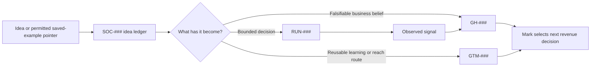

# Epoch 1 Social Learning Lane — Architecture and Run Outline

Last updated: 2026-07-16 08:36:19 PDT — edited by: Codex

This proposal gives Mark one modular place to capture social ideas, connect
them to revenue learning when earned, and test human-in-the-loop systems without
creating a second Epoch or an automation platform prematurely. [DR-36](../decisions/2026-07-16-social-intelligence-founder-content-direction.md)

## A. Placement recommendation

- `A1` **Use one Epoch 1 lab (recommended):** add a cross-cutting Social Learning
  Lane inside the current growth system; do not open a separate epoch, clone,
  or documentation worktree now.
- `A2` **Preserve loose capture:** store ideas in the
  [Social Idea Ledger](../growth/SOCIAL-IDEA-LEDGER.md), where an idea may remain
  unlinked until its decision and audience are clear.
- `A3` **Promote by meaning:** use `GH-###` for a falsifiable growth belief,
  `GTM-###` for a reusable market-learning/reach motion, `SIGNALS.md` for
  observed evidence, and `RUN-###` for one bounded execution.
- `A4` **Separate strategy from implementation:** keep Pulse/n8n/Replit as
  adapters. Use a branch or worktree in the Pulse repository only after a
  separately approved code change needs isolation.
- `A5` **Split only on evidence:** consider a separate Epoch or project when the
  lane has a distinct objective and owner, recurring approved work, its own
  data/compliance boundary, and enough maintenance load to harm the main lab.

## B. Minimal architecture and human touch

| Layer | Automation / agent role | Mark-only role | Canonical surface |
| --- | --- | --- | --- |
| Capture | Ingest permitted pointers, deduplicate, transcribe a faithful summary. | Decide whether an idea matters and supply private context intentionally. | `growth/SOCIAL-IDEA-LEDGER.md` |
| Interpret | Cluster mechanics/themes; suggest links and contradictions. | Decide meaning, worldview, theme, audience promise, and what feels true enough to test. | Ledger plus `HYPOTHESES.md` / `GTM-MOTIONS.md` |
| Select | Rank options against time, revenue relevance, evidence gap, and maintenance cost. | Choose the experiment and acceptable tradeoff. | Draft run brief / Master Checklist |
| Create | Prepare internal briefs, hooks, drafts, variants, and source checks. | Supply lived perspective, edit voice, make ethical/community judgments, and approve the final piece. | Run outputs until approved externally |
| Learn | Collect permitted metrics, summarize comments, and flag anomalies. | Interpret qualitative resonance and choose advance/revise/park. | `SIGNALS.md` and owning GH/GTM record |

## C. Fidelity-preserving run portfolio

These are outlines, not run cards or approvals. Assign a `RUN-###` only after
Mark selects `X2`; execute only after `X3`.

| Ref | Candidate workflow | One decision it resolves | Minimum inputs | Gate / dependency |
| --- | --- | --- | --- | --- |
| `C1` | `social-learning-architecture-audit` v0.1 | Can the existing Pulse/n8n/Replit assets serve as replaceable adapters inside one Epoch 1 lane, and what should be reused, revised, or parked? | Local code/workflow exports, [[growth/SOCIAL-IDEA-LEDGER|SOC-001]]–[[growth/SOCIAL-IDEA-LEDGER|SOC-007]], current official platform terms. | Recommended first; local/public research only, no build or reactivation. |
| `C2` | `founder-theme-portfolio` v0.1 | Which one primary theme/audience/platform pair, with at most two parked alternatives, best connects Mark's range to a revenue-learning goal? | Ledger, existing account history, permitted saved-example pointers, current GH/GTM records. | After C1 or independently if Mark wants strategy before technology. |
| `C3` | `manual-social-baseline` v0.1 | Does one focused, Mark-authored channel test produce enough qualified resonance and sustainable cadence to continue? | One C2 route, baseline metrics, fixed time/post ceiling, Mark-owned publishing. | Separate market-test approval; no automated posting. |
| `C4` | `viral-pattern-transfer` v0.1 | Does an original adaptation of one proven content mechanic outperform the C3 baseline for the same audience and theme? | Small permitted pattern set and frozen evaluation rubric. | Only after a baseline; test the mechanic, never promise virality or copy expression. |
| `C5` | `human-touch-shadow-rehearsal` v0.1 | Can an agent brief and draft system reduce Mark's effort while preserving voice, judgment, and decision quality? | One proven route and a Mark voice/values rubric. | Shadow mode first; Mark remains final editor and publisher. |
| `C6` | `pulse-topic-adapter` v0.1 | Can one Pulse/n8n topic adapter create decision-useful, compliant intelligence at acceptable duplication, cost, and maintenance? | Approved source/topic, sanitized workflow copy, explicit platform authorization. | Only after C1 and a real recurring information need; no outreach. |
| `C7` | `replit-operating-layer` v0.1 | Should Replit remain the development/deployment layer, be narrowed, or be replaced? | C1 portability map, actual usage/cost, uptime, Git/secrets/recovery checks. | Run separately only if C1 cannot resolve it. |

## D. Recommended first run — editable R1–R12 outline

| Ref | Draft |
| --- | --- |
| `R1` | Decide whether Pulse/n8n/Replit can be a modular adapter set for one Epoch 1 Social Learning Lane, and identify the smallest next validation step. |
| `R2` | Link [[decisions/2026-07-16-social-intelligence-founder-content-direction#dr-36--social-intelligence-and-founder-content-exploration-direction|DR-36]], [[growth/SOCIAL-IDEA-LEDGER|SOC-001]]–[[growth/SOCIAL-IDEA-LEDGER|SOC-007]], [[growth/SEGMENTS#seg-001--care-delivery-organizations|SEG-001]], possible [[growth/ICP-REGISTRY|ICP-006]], [[growth/GTM-MOTIONS#gtm-001--account-led-buyer-discovery|GTM-001]], [[growth/CDP-001|CDP-001]], [[runs/run-007/RUN-007-Influence-Map|RUN-007]], [[runs/run-008/RUN-008-Narrative-Pain-Map|RUN-008]], and the two named local project surfaces. |
| `R3` | `workflow_id: social-learning-architecture-audit`; `workflow_version: v0.1`; use one evidence-first architecture audit, not a platform build. |
| `R4` | `execution_kind: initial`; `parent_run: N/A`; `run_type: lab-validation`. |
| `R5` | Map current data flow/dependencies; define the minimal record and human-touch contract; compare one-lab/separate-epoch/standalone-system placements; return reuse/revise/park decisions and a dependency-ordered run portfolio. |
| `R6` | Use local code/workflow exports plus current official Replit, n8n, and Reddit terms. Treat founder claims as founder claims and inaccessible runtime state as unknown. |
| `R7` | One primary Codex agent; no swarm or model comparison. Source verification is required for current platform claims. |
| `R8` | Strictest input class `local-only`; retain only safe summaries. No secrets, private platform content, paid provider, model call, reactivation, scraping, monitoring, build, publishing, outreach, or CRM write. |
| `R9` | Three-hour ceiling. Stop if credentials/private data are required, authorization is unclear, or a proposed answer depends on running/changing the production workflow. |
| `R10` | Pass: one placement recommendation, component disposition, risk/unknown ledger, human-touch map, and one next decision. Fail: recommends a new system without resolving asset fit or boundaries. Inconclusive: required runtime/cost/authorization evidence is unavailable. |
| `R11` | Run report, current-state architecture map, reuse/revise/park table, compliance questions, and narrowed future-run outlines; no code or external changes. |
| `R12` | Advance to one strategy run, request a separate compliance/technical approval, revise the lane, or park the assets. |

## E. Open choices and operating guardrails

- `E1` Mark selects the placement, first decision, and evidence scope before a
  draft run card is created.
- `E2` No new Epoch, clone, or worktree is justified by idea volume alone; the
  separation trigger is recurring, distinct, approved execution with its own
  owner/data boundary.
- `E3` Replit may remain the speed layer while Git remains authoritative.
  Replit officially supports [Git/GitHub workflows](https://docs.replit.com/learn/projects-and-artifacts/version-control),
  [paid-plan SSH access](https://docs.replit.com/features/workspace-tools/ssh),
  and several [deployment types](https://docs.replit.com/features/publishing/deployment-types);
  the chosen deployment and spend still need to match the actual workload.
- `E4` The Reddit adapter remains inactive. Current official terms say
  [commercial API use may require a separate agreement](https://redditinc.com/policies/data-api-terms),
  and current [spam guidance](https://support.reddithelp.com/hc/en-us/articles/360043504051-Spam)
  makes community-specific review and authentic human participation mandatory
  before any engagement design.
- `E5` Version and restore the n8n exports and complete the second-device Git
  continuity task before relying on either surface operationally. n8n's
  [built-in Git environments](https://docs.n8n.io/source-control-environments/create-environments/)
  are plan-gated, so a private sanitized-export repository may be the smaller
  path; either is an internal reliability control, not social-strategy evidence.
