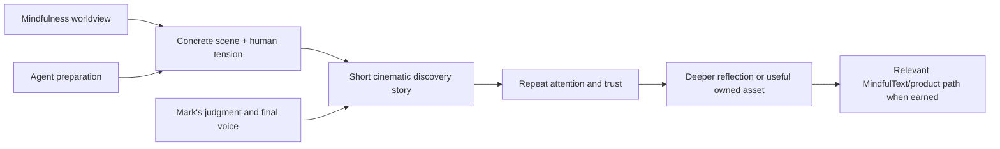

# [[runs/run-018/RUN-018-Mindfulness-Social-Studio|RUN-018]] — Social Studio Operating Model

Last updated: 2026-07-28 10:44:41 PDT — edited by: Codex

## The identity to hold constant

**Mindfulness is how we notice what fast systems make us miss—then choose a
more human response.**

The working public promise is: *cinematic, wry stories about the human
operating system of ambitious work—how people lose attention, agency, or care
inside fast systems, and the small choices that restore them.* This is founder
direction, not a claim of public resonance or a health outcome. It extends
[[growth/BRAND-DIRECTION|BRD-001]] and [[growth/SOCIAL-IDEA-LEDGER|SOC-008]]
without replacing MindfulText's product positioning.

### Use lenses, not separate brands

| Lens | What it supplies | What it is not |
| --- | --- | --- |
| AI and modern work | New tools, speed, attention, and authorship tensions. | Generic AI news or tutorials. |
| Founder and accelerator life | Decisions, ambition, responsibility, and systems that shape people. | Universal business advice. |
| Care and healthcare | Emotional labor, handoffs, and the humanity inside high-stakes systems. | Clinical commentary, diagnosis, or a claim about workers as a group. |
| Film and storytelling | Scenes, characters, visual texture, and a memorable narrative turn. | Production polish for its own sake. |

Every story needs a concrete setting and a human tension. The underlying theme
remains mindfulness; it should not become a loose wellness category.

## Channel architecture: one story, distinct jobs

| Surface | Recommended job | Operating decision |
| --- | --- | --- |
| Existing personal Instagram | Private life and relationships. | Keep personal by default. Do not block people to manipulate recommendations; use privacy controls or blocks only for comfort, safety, or boundaries. |
| Existing AI Instagram and TikTok | Provisional public discovery surface for the Mark story world. | Do not create another account yet. When a manual baseline is separately approved, test a bridge from AI into modern-work and human-systems stories. |
| LinkedIn personal profile | Later director's-cut / business context for work already proven on short video. | Do not start as a parallel content factory; add only after the short-video voice is legible. |
| MindfulText-owned surfaces | Product-aligned education and transparent company communication. | Keep distinct from Mark's broad personal storytelling and from any unqualified Pulse material. |

The account decision rule is simple: make a new account only when it has a
different audience, job, and sustainable input system. A new interest alone is
not enough. This keeps [[growth/SOCIAL-IDEA-LEDGER|SOC-003]] focused while
respecting the prior effort warning in [[growth/SOCIAL-IDEA-LEDGER|SOC-004]].

## Story and funnel path

The funnel is a design hypothesis, not an attribution claim. The first
obligation is a story worth watching; product connection comes only when it is
genuinely relevant and clearly separated from health or efficacy claims.

### Repeatable story card

1. **Spot the tension:** Name a recognizable gap: optimizing everything except
   attention, mistaking urgency for insight, or treating people as throughput.
2. **Stage a scene:** Use a meeting, dashboard, shift change, founder moment,
   or filmmaker's framing device.
3. **Turn the lens:** Reveal the human cost without scolding or punching down.
4. **Offer one small move:** Pause, clarify, credit someone, protect attention,
   ask a better question, or repair.
5. **Choose the bridge:** Stop at reflection, point to a useful owned resource,
   or transparently name MindfulText only if it adds real context.

At one story per week, this structure creates 52 prompts a year before adding
any external sources. At two per week, it produces 104. Quantity is not a
reason to publish; the structure simply prevents the brand from depending on
constant novelty.

## Human-agent operating system

| Role | Agent may do | Mark must do |
| --- | --- | --- |
| Evidence steward | Keep source pointers, claim boundaries, and a known/assumed/unknown ledger. | Decide what is true enough to say and what should remain private. |
| Pattern scout | Surface permitted cultural, product, or work tensions for consideration. | Pick what matters and reject borrowed/copying-prone expression. |
| Story room | Turn a selected tension into several hooks, beats, and draft endings. | Supply lived material, choose the angle, and write the final voice. |
| Production planner | Create a shot/asset checklist and production-light variants. | Decide visual taste, consent, and whether any media should be made. |
| Learning analyst | Summarize metrics and comments that Mark has deliberately supplied after a future approved test. | Interpret resonance, community context, and advance/revise/park decisions. |

No role may publish, comment, message, follow, engage, scrape, create accounts,
or autonomously retrieve private/platform-authenticated data. This operationalizes
[[growth/SOCIAL-IDEA-LEDGER|SOC-005]] as assistance, not a social automation
system.

## Smallest next manual baseline — not yet authorized

If Mark chooses to test this route, draft a separate market-test card with:

- the existing AI Instagram/TikTok pair as the sole provisional public account;
- a six-story bridge ceiling: four AI/modern-work scenes and two broader
  human-systems scenes;
- one primary non-vanity learning signal, such as thoughtful replies from the
  intended audience or repeat attention, plus a time-cost cap; and
- Mark-owned publishing, interaction, and review.

No baseline, content creation, account edit, or post is authorized by this
operating model. Any Pulse-derived premise is also gated by
[[runs/run-019/RUN-019-Pulse-Public-Asset-Audit|RUN-019]].

## Related records

- [[runs/run-018/RUN-018-Mindfulness-Social-Studio|RUN-018]]
- [[growth/BRAND-DIRECTION|BRD-001]]
- [[growth/SOCIAL-IDEA-LEDGER|SOC-005]]
- [[growth/SOCIAL-IDEA-LEDGER|SOC-009]]
- [[runs/run-019/RUN-019-Pulse-Public-Asset-Audit|RUN-019]]
- [[runs/run-018/outputs/SOURCES|sources]]
